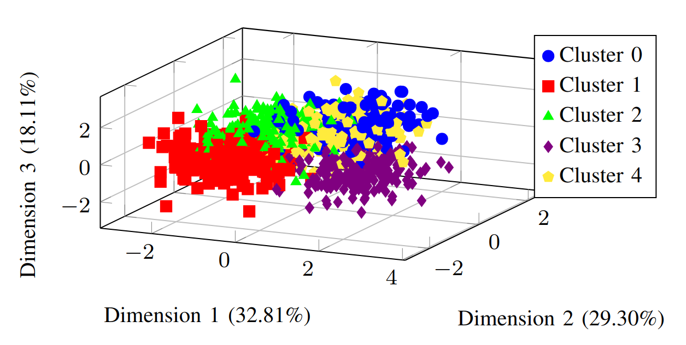
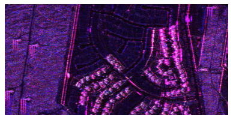
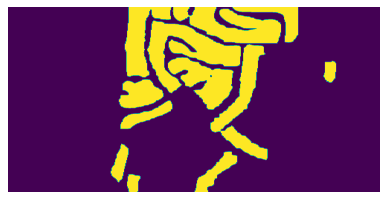

# Scoring Frugality for Remote Sensing Data Processing Algorithms

This repository contains the code associated to the paper [*Scoring Frugality for Remote Sensing Data Processing Algorithms*](doc/submit_EUSIPCO_2025.pdf) to carry out frugality analysis on clustering and change detection tasks.

> In remote sensing, the demand for extensive data processing algorithms continues to grow exponentially. Assessing the frugality of data processing algorithms has become a priority in the machine learning and artificial intelligence community. However, defining a quantifiable measure that combines performance and energy consumption remains a complex challenge. This paper introduces a methodology for collecting energy consumption data and presents three different frugality scoring methods. Through a case study of two classical data processing tasks in remote sensing, change detection and clustering, we demonstrate that these three scores capture different aspects of frugality. We further suggest a combined approach for users to achieve a more comprehensive assessment.

**WORK IN PROGRESS**

## Repository structure

```bash
.
├── data
│   └── ...
├── doc
│   ├── static
│   │   ├── Scene_1small.png
│   │   └── Scene_1small_truth.png
│   └── submit_EUSIPCO_2025.pdf
├── environment.yml
├── LICENCE
├── README.md
└── src
    └── performance-tracking
        ├── experiments
        │   ├── conso
        │   │   ├── analyse_stats.py
        │   │   ├── get_conso.py
        │   │   ├── get_stats.py
        │   │   ├── query_influx.sh
        │   │   ├── simulation_metrics_exec.sh
        │   │   ├── stats_summary_blob.py
        │   │   ├── stats_summary_deep.py
        │   │   └── stats_summary.py
        │   ├── conso_change
        │   │   ├── cd_sklearn_pair_var.py
        │   │   ├── change-detection.py
        │   │   ├── functions.py
        │   │   ├── get_perf.py
        │   │   ├── helpers
        │   │   │   └── multivariate_images_tool.py
        │   │   └── main.py
        │   ├── conso_classif_deep
        │   │   ├── classif_deep.py
        │   │   ├── get_perf.py
        │   │   ├── get_scores.py
        │   │   ├── read_event.py
        │   │   ├── read_events.py
        │   │   └── simulation_metrics_exec.sh
        │   └── conso_clustering
        │       ├── clustering_blob.py
        │       ├── clustering.py
        │       ├── get_perf_blob.py
        │       ├── get_perf.py
        │       ├── helpers
        │       │   └── processing_helpers.py
        │       ├── plot_clustering.py
        │       ├── utils_clustering_blob.py
        │       └── utils_clustering.py
        ├── plot_usage.py
        ├── README.md
        └── simulation_metrics_exec.sh
```

## Installation

### Dependencies

python 3.11.8, codecarbon 2.3.4, numpy 1.26.4, pandas 2.2.1, scikit-learn 1.4.1
```bash
conda env create -f environment.yml
conda activate frugal-score
```

## Data

This repository presents the code for frugality evaluation for two remote sensing data processing tasks : clustering and change detection.

The clustering task was carried out on a toy dataset containing 1000 instances divided in 5 blobs on 5 features wuth a standard variation of 5. Its projection over the first 3 dimensions of the PCA is presented following



The change detection task was carried out on multiband PolSAR image time series from the UAVSAR (Courtesy NASA/JPL-Caltech) [[1]](#1) with ground truth data from [[2]](#2).




## Usage

| File | Associated command | Description |
| ---- | ------------------ | ----------- |
| [change-detection.py](src/performance-tracking/experiments/conso_change/change-detection.py)  | `python change-detection.py --storage_path [PATH_TO_FOLDER_TO_STORE_RESULTS] --image [PATH_TO_FOLDER_WITH_IMAGES] --window [WINDOW_SIZE] --cores [NUMBER_OF_CORES_USED] --number_run [NUMBER_OF_RUNS] --robust [ROBUSTNESS ID]` | Runs change detection algorithms on UAVSAR data |
| [clustering_blob.py](src/performance-tracking/experiments/conso_clustering/clustering_blob.py)  | `python clustering_blob.py --storage_path [PATH_TO_FOLDER_TO_STORE_RESULTS] --data_seed [SEED] --random_seed [SEED] --n_clusters [NUMBER_OF_CLUSTERS] --model [CLUSTERING_METHOD] --repeat [NUMBER_OF_MODEL_RUNS] --number_run/-n [NUMBER_OF_RUNS]` | Runs clustering algorithms on toy data |
| [plot_change_detection.py](src/plot_change_detection.py)  | `python plot_change_detection.py --result_path [PATH_TO_RESULTS] --output_path [OUTPUT_PATH]` | Plot score results for change detection |
| [plot_clustering.py](src/plot_clustering.py)  | `python plot_clustering.py --result_path [PATH_TO_RESULTS] --output_path [OUTPUT_PATH]` | Plot score results for clustering |

## Authors

* [Matthieu Verlynde](https://github.com/MattVerlynde) ([matthieu.verlynde@univ-smb.fr](mailto:matthieu.verlynde@univ-smb.fr))
* [Ammar Mian](https://ammarmian.github.io/) ([ammar.mian@univ-smb.fr](mailto:ammar.mian@univ-smb.fr))
* [Yajing Yan](https://www.univ-smb.fr/listic/en/presentation_listic/membres/enseignants-chercheurs/yajing-yan-fr/) ([yajing.yan@univ-smb.fr](mailto:yajing.yan@univ-smb.fr))

## References
>  <a id="1">[1]</a>  A. Mian, G. Ginolhac, J.-P. Ovarlez, and A. M. Atto, “New Robust Statistics for Change Detection in Time Series of Multivariate SAR Images,” IEEE Transactions on Signal Processing, vol. 67, no. 2, pp. 520–534, Jan. 2019. [Online]. Available: https://ieeexplore.ieee.org/document/8552453/<br>
>  <a id="2">[2]</a>  A. D. C. Nascimento, A. C. Frery, and R. J. Cintra, “Detecting changes in fully polarimetric sar imagery with statistical information theory,” IEEE Transactions on Geoscience and Remote Sensing, vol. 57, no. 3, pp. 1380–1392, 2019.