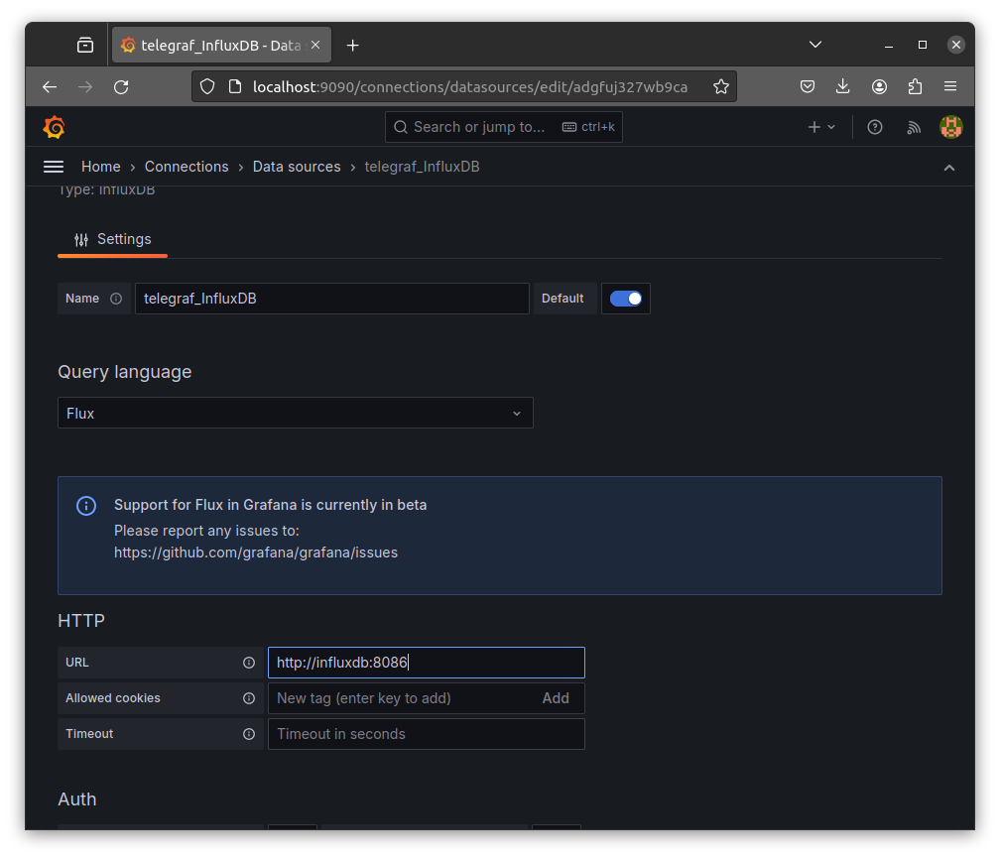
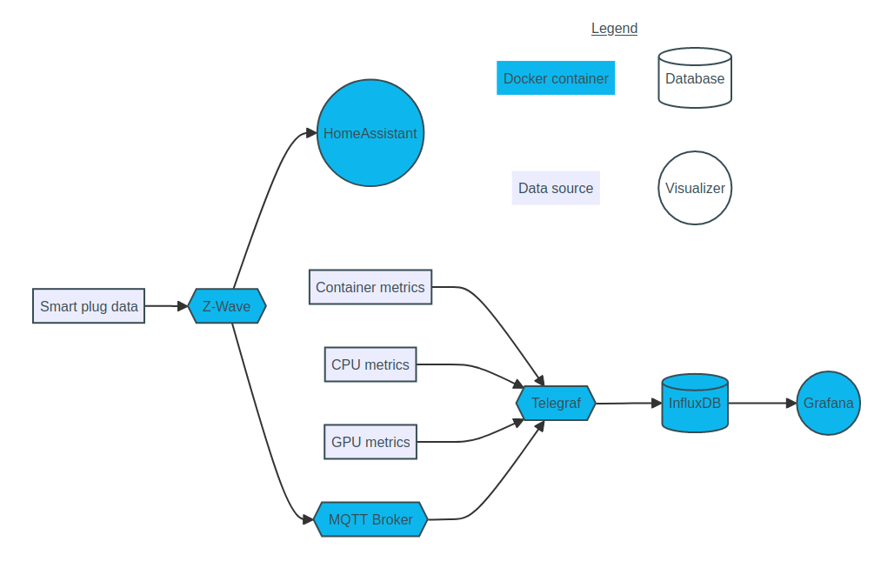

# Configuration for energy consumption tracking

This page summaries the installation procedure for the reading, writieng, storing and visualizing pipeline for internal hardware usage data. This work is based on the **Telegraf-InfluxDB-Grafana** pipeline (TIG). It is largely inspired by the tutorial available online at [https://domopi.eu/tig-le-trio-telegraf-influxdb-grafana-pour-surveiller-vos-equipements/](https://domopi.eu/tig-le-trio-telegraf-influxdb-grafana-pour-surveiller-vos-equipements/).
This guide also presents the interrogation procedure of the **InfluxDB** database after the execution of a python scriptusing a bash script.

```bash
.
├── get_metrics.sh
├── grafana_dashboard_template.json
├── README.md
├── screenshots_config
│   ├── grafana_import_dashb1.png
│   ├── grafana_import_dashb2.png
│   ├── grafana_import_dashb3.png
│   ├── grafana_select_influx.png
│   ├── grafana_set_datasource1.png
│   ├── grafana_set_datasource2.png
│   └── grafana_welcome.png
├── smart-switch
│   ├── add-device-ha.png
│   ├── config-homeassist.png
│   ├── enable-stats.png
│   ├── first-data.png
│   ├── new-entry.png
│   ├── pipeline.png
│   └── smart-start.png
│   ├── smartswitch7.jpg
│   └── zstick7.jpg
└── tig
    ├── docker-compose.yml
    └── telegraf
        └── telegraf.conf
```

<!--more-->

## Pipeline presentation


The Telegraf plugin, produced by InfluxDB, allows the live collection of hardware usage data and their formatting. The ZWave-JS UI plugin collects data from a connected plug, and transfers them to Telegraf using the Mosquitto plugin.
InfluxDB stores the data in time series format, and forms the interrogated database within the pipeline; Grafana is a visualisation data anlysis tool used with the InfluxDB database.

## TIG configuration

### Installation

> This tutorial focuses on the pipeline installation using Docker, and depend on its previous installation.

We start by downloading the Docker images of the three plugins within the pipeline.

```shell
docker pull telegraf
docker pull influxdb
docker pull grafana/grafana-oss
```
We will use the `docker compose` command to build our pipeline. We use a building file `docker-compose.yml` after choosing a Grafana entering port. For this example, we choose the port `9090`.

```yaml
version: "3.8"
services:
  influxdb:
    image: influxdb
    container_name: influxdb
    restart: always
    ports:
      - 8086:8086
    hostname: influxdb
    environment:
      INFLUX_DB: $INFLUX_DB  # database name
      INFLUXDB_USER: $INFLUXDB_USER  # user name
      INFLUXDB_USER_PASSWORD: $INFLUXDB_USER_PASSWORD  # user password
      DOCKER_INFLUXDB_INIT_MODE: $DOCKER_INFLUXDB_INIT_MODE
      DOCKER_INFLUXDB_INIT_USERNAME: $DOCKER_INFLUXDB_INIT_USERNAME
      DOCKER_INFLUXDB_INIT_PASSWORD: $DOCKER_INFLUXDB_INIT_PASSWORD
      DOCKER_INFLUXDB_INIT_ORG: $DOCKER_INFLUXDB_INIT_ORG
      DOCKER_INFLUXDB_INIT_BUCKET: $DOCKER_INFLUXDB_INIT_BUCKET
      DOCKER_INFLUXDB_INIT_RETENTION: $DOCKER_INFLUXDB_INIT_RETENTION
      DOCKER_INFLUXDB_INIT_ADMIN_TOKEN: $DOCKER_INFLUXDB_INIT_ADMIN_TOKEN
    volumes:
      - ./influxdb:/var/lib/influxdb  # volume to store the InfluxDB database

  telegraf:
    image: telegraf
    depends_on:
      - influxdb  # indicate that influxdb is necessary
    container_name: telegraf
    restart: always
    links:
      - influxdb:influxdb
    tty: true
    volumes:
      - /var/run/docker.sock:/var/run/docker.sock  # necessary to fetch data from the Docker daemon
      - ./telegraf/telegraf.conf:/etc/telegraf/telegraf.conf  # configuration file for Telegraf
      - /:/host:ro # necessary to fetch data from host (processes, threads...)

  grafana:
    image: grafana/grafana-oss
    depends_on:
      - influxdb  # indicate that influxdb is necessary
    container_name: grafana
    restart: always
    ports:
      - 9090:3000  # port to access the web interface of Grafana
    links:
      - influxdb:influxdb
    environment:
      GF_INSTALL_PLUGINS: "grafana-clock-panel,\
                          grafana-influxdb-08-datasource,\
                          grafana-kairosdb-datasource,\
                          grafana-piechart-panel,\
                          grafana-simple-json-datasource,\
                          grafana-worldmap-panel"
      GF_SECURITY_ADMIN_USER: $GF_SECURITY_ADMIN_USER  # user name for Grafana
      GF_SECURITY_ADMIN_PASSWORD: $GF_SECURITY_ADMIN_PASSWORD  # user password for Grafana
    volumes:
      - ./grafana:/var/lib/grafana-oss
```

> This file is available at: [tig/docker-compose.yml](tig/docker-compose.yml).

This file is built with a dependant to an file containing environment variables. We buld this file `.env` with the variable values in the same repository.

```yaml
INFLUX_DB=telegraf
INFLUXDB_USER=telegraf_user
INFLUXDB_USER_PASSWORD=telegraf_password
GF_SECURITY_ADMIN_USER=grafana_user
GF_SECURITY_ADMIN_PASSWORD=grafana_password
DOCKER_INFLUXDB_INIT_MODE=setup
DOCKER_INFLUXDB_INIT_USERNAME=telegraf_user
DOCKER_INFLUXDB_INIT_PASSWORD=telegraf_password
DOCKER_INFLUXDB_INIT_ORG=telegraf_org
DOCKER_INFLUXDB_INIT_BUCKET=telegraf_bucket
DOCKER_INFLUXDB_INIT_RETENTION=365d
DOCKER_INFLUXDB_INIT_ADMIN_TOKEN=telegraf_token
```

> This file is available at: [tig/.env](tig/.env).

We now configure the parameters for Telegraf. In the bash shell, run the following lines:

```shell
mkdir telegraf
docker run --rm telegraf telegraf config > telegraf/telegraf.conf
```

This command created the default Telegraf configuration file, which we modify for our project.

```squidconf

# Configuration for telegraf agent
[agent]
  
  [...]

  ## Override default hostname, if empty use os.Hostname()
  hostname = "telegraf"
  ## If set to true, do no set the "host" tag in the telegraf agent.
  omit_hostname = false

[...]

###############################################################################
#                            OUTPUT PLUGINS                                   #
###############################################################################


# # Configuration for sending metrics to InfluxDB 2.0
[[outputs.influxdb_v2]]
#   ## The URLs of the InfluxDB cluster nodes.
#   ##
#   ## Multiple URLs can be specified for a single cluster, only ONE of the
#   ## urls will be written to each interval.
#   ##   ex: urls = ["https://us-west-2-1.aws.cloud2.influxdata.com"]
   urls = ["http://influxdb:8086"]
#
#   ## Token for authentication.
   token = "telegraf_token"
#
#   ## Organization is the name of the organization you wish to write to.
   organization = "telegraf_org"
#
#   ## Destination bucket to write into.
   bucket = "telegraf_bucket"

   [...]

[...]

[[outputs.influxdb]]
#   ## The full HTTP or UDP URL for your InfluxDB instance.
#   ##
#   ## Multiple URLs can be specified for a single cluster, only ONE of the
#   ## urls will be written to each interval.
#   # urls = ["unix:///var/run/influxdb.sock"]
#   # urls = ["udp://127.0.0.1:8089"]
#   # urls = ["http://127.0.0.1:8086"]
   urls = ["http://influxdb:8086"]

   [...]

#   ## HTTP Basic Auth
   username = "telegraf_user"
   password = "telegraf_password"

   [...]

[...]

[[inputs.docker]]
#   ## Docker Endpoint
#   ##   To use TCP, set endpoint = "tcp://[ip]:[port]"
#   ##   To use environment variables (ie, docker-machine), set endpoint = "ENV"
   endpoint = "unix:///var/run/docker.sock"

   [...]

[...]

# # Monitor process cpu and memory usage
[[inputs.procstat]]
   pattern = ".*"
   fieldpass = ["cpu_time_system", "cpu_time_user", "cpu_usage", "memory_*", "num_threads", "*pid"]
   pid_finder = "native"
   pid_tag = true

   [...]

[...]

# # Read metrics about temperature
[[inputs.temp]]

[...]

```
Apply these modifications :
* In `[agent]`, the variable `hostname` with the value of the environment variable `INFLUX_DB`, here `"telegraf"`

* Uncomment `[[outputs.influxdb_v2]]`, set `urls` with `["http://influxdb:8086"]`, and set `token`, `organization` and `bucket` with the environment variables `DOCKER_INFLUXDB_INIT_ADMIN_TOKEN`, `DOCKER_INFLUXDB_INIT_ORG` and `DOCKER_INFLUXDB_INIT_BUCKET`, here `"telegraf_token"`, `"telegraf_org"` and `"telegraf_bucket"`.

* Comment `[[outputs.file]]`. We do not need any save file within Telegraf in with InfluxDB.

* Uncomment `[[outputs.influxdb]]`, set `urls` with `["http://influxdb:8086"]`, and set `username` and `password` with the environment variables `DOCKER_INFLUXDB_INIT_USERNAME` and `DOCKER_INFLUXDB_INIT_PASSWORD`, here `"telegraf_user"` and `"telegraf_password"`.

* Uncomment `[[inputs.docker]]`, set `endpoint` with `"unix:///var/run/docker.sock"`.

* Uncomment `[[inputs.procstat]]`, set `pattern` with `".*"` to fetch data from every process, set `fieldpass` with our variables of interest, here `["cpu_time_system", "cpu_time_user", "cpu_usage", "memory_*", "num_threads", "*pid"]`, set `pid_finder` with `"native"` to access host data from outside the container, and set `pid_tag` with `true` to conserve the processes' ids,

* Uncomment `[[inputs.temp]]` to fetch the CPU and NVME temperature data.

> This file is available at: [tig/telegraf/telegraf.conf](tig/telegraf/telegraf.conf).

We then can create the containers.

```shell
docker compose up -d
```

Check that the containers have been created with the following command:

```shell
docker ps
```

If the containers have been created, we can access the Grafana interface on the chosen port, here at `http://localhost:9090`.

> We also can access the InfluxDB interface on the chosen port put within the `docker-compose.yml` file, here at `http://localhost:8086`.

We can then configure Grafana.

### Configuration of Grafana

On the Grafana welcoming page, connect using the user name and password used in the file `.env`. In this example, `grafana_user` and `grafana_password`.


Configure the data source, and choose InfluxDB as source type.


Configure the data source with the InfluxDB port, and select `FLUX` as the database interrogation language.



Add the database connection credentials with the ones from c.


Import a compatible visualization dashboard with our configuration. We can choose one online, but the one of id `15650` is well-suited for this example.


Choose the configured source before import.


Fanally, choose the dashboard parameters for our data, here the bucket name we configured in the file `.env`.


We then can modify our dashboard to our preferences, choosing different parameters or queries (in [FLUX](https://docs.influxdata.com/influxdb/cloud/query-data/get-started/query-influxdb/) language).

Another possibility is to import the dashboard from a `.json` file. The configured file for this project is available at: [grafana_dashboard_template.json](grafana_dashboard_template.json).

### Interrogation of the database

To interrogate the **InfluxDB** database previously created, we use a bash script executing a python script as argument. We then interrogate the database to collect inserted data during the python script running time.

> This file is available at: [get_metrics.sh](get_metrics.sh).

This file is executed as follow:

```bash
bash get_metrics.sh -f [python.file] (-p) (-P [pid])
```
* the flag `-f` is required and precedes the python file name to execute,
* the flag `-P` is optional : if used, the collected data are the ones associated to the process with the id in the file `python_process.pid` during the python script running time,
* the flag `-p` is optional : if used, the collected data are the ones associated to the process with the id follow ing the flag in the command,
* if the flags `-p` and `-P` are not used, data for all processes are collected.

The collected data are saved within a file `metrics_output`.

The collecting file `get_metrics.sh` is organised as follow:

```bash
#!/bin/bash

#Collecting input arguments
while getopts 'f:p:P:' OPTION; do
  case "$OPTION" in
    f)
      name_file="$OPTARG"
      ;;
    P) 
      by_pid=true
      get_pid=true
      ;;
    p) 
      by_pid=true
      get_pid=false
      npid="$OPTARG"
      ;;
    \?)
      echo "Invalid option: $OPTARG" 1>&2
      exit 1
      ;;
  esac
done
: ${name_file:?Missing -f}

#Execution starting time
t1=$(date -u +%Y-%m-%dT%T.%9NZ)
echo "*************************************************"
echo "Time start: $t1"
echo "*************************************************"
echo "Running python script: $name_file"
echo "*************************************************"

#Execution of the chosen python script
python3 $name_file

#Execution ending time
t2=$(date -u +%Y-%m-%dT%T.%9NZ)

echo "*************************************************"
echo "Time stop: $t2"
echo "*************************************************"


if [ "$by_pid" = true ]; then
  if [ "$get_pid" = true ]; then
    # Collecting process id if not within the input arguments 
    npid=$(cat python_process.pid)
  fi
  echo "Process ID: ${npid}"
  # Building of the process query
  query="data=from(bucket: \"telegraf_bucket\")
    |> range(start: ${t1}, stop: ${t2})
    |> filter(fn: (r) => r[\"_measurement\"] == \"procstat\")
    |> filter(fn: (r) => r[\"pid\"] == \"${npid}\")
    |> aggregateWindow(every: 1s, fn: mean, createEmpty: false)
    |> yield(name: \"mean\")"
else
  # Building of the whole data query
  query="data=from(bucket: \"telegraf_bucket\")
    |> range(start: ${t1}, stop: ${t2})
    |> aggregateWindow(every: 1s, fn: mean, createEmpty: false)
    |> yield(name: \"mean\")"
fi

# Query writing
echo $query > query

# Copy of the query in the InfluxDB container
sudo docker cp query influxdb:/query

# Execution of the query in the container, and export of the output in metrics_output
sudo docker exec -it influxdb sh -c 'influx query -f query -r' > metrics_output

echo "*************************************************"
echo "File metrics_output created"
echo "*************************************************"
head metrics_output
echo "*************************************************"
```

Format of the output in `metrics_output` :

```text
#group,false,false,true,true,false,false,true,true,true,true,true,true

#datatype,string,long,dateTime:RFC3339,dateTime:RFC3339,dateTime:RFC3339,double,string,string,string,string,string,string

#default,mean,,,,,,,,,,,

,result,table,_start,_stop,_time,_value,_field,_measurement,host,pattern,pid,process_name

,,0,2024-03-27T16:15:21.073488201Z,2024-03-27T16:15:57.890192557Z,2024-03-27T16:15:31Z,6.46,cpu_time_system,procstat,telegraf,.*,1601463,python3

,,0,2024-03-27T16:15:21.073488201Z,2024-03-27T16:15:57.890192557Z,2024-03-27T16:15:41Z,6.87,cpu_time_system,procstat,telegraf,.*,1601463,python3

,,0,2024-03-27T16:15:21.073488201Z,2024-03-27T16:15:57.890192557Z,2024-03-27T16:15:51Z,7.46,cpu_time_system,procstat,telegraf,.*,1601463,python3

[...]
```

## Tracking energy consumption

Once the TIG pipeline configured, we will introduce the connected plug into it to collect energy consumption information.

Smart Switch 7 plug Aeotec &reg; |  Z Stick 7 controller Aeotec &reg;
:-------------------------:|:-------------------------:
  |  

Creating of the Docker container for the  Home Assistant application (specific dashboard optimized for Z-Wave): 

```bash
sudo docker run -d \
  --name homeassistant \
  --privileged \
  --restart=unless-stopped \
  -e TZ=Europe/Paris \
  -v ~/homeassistant:/config \
  -v /run/dbus:/run/dbus:ro \
  --network=host \
  ghcr.io/home-assistant/home-assistant:stable
```

Creation of the repository with Z-Wave configurations: 

```bash
cd homeassistant
mkdir docker
mkdir docker/zwave-js
```

Fetching of the Network's name in with telegraf is installed:

```bash
sudo docker inspect telegraf -f '{{range $k, $v := .NetworkSettings.Networks}}{{printf "%s\n" $k}}{{end}}'
```

Fetching the USB controller's name :

```bash
dmesg | grep tty
```

Creating of the Docker container for the Z-Wave JS application: 

```bash
sudo docker run -d \
  --network [TELEGRAF_NETWORK] \
  --restart=always \
  -p 8091:8091 \
  -p 3002:3000 \
  --device=[USB_CONTROLLER] \
  --name="zwave-js" \
  -e "TZ=Europe/Paris" \
  -v ~/homeassistant/docker/zwave-js:/usr/src/app/store zwavejs/zwavejs2mqtt:latest
```

Configuration of Z-Wave JS on the chosen port:

To configure Z-Wave JS to collect data from the connected plug, we access its interface in the page `Smart Start`, here at `http://localhost:8091`.


Add the information from the Smart Switch device, using the `Add` button, and add the DSK code from the connected plug (written on the packaging) and enable all security systems.


Once the plug added, configure the application's parameters. At the page `Settings`, at `Z-Wave`, add the previously identified USB controller name. 

Check that statistics save is enabled.


Finally, in `Home Assistant`, add the IP address of the Z-Wave container as host. This address can be found using the command `docker sudo docker inspect --format '{{ .NetworkSettings.IPAddress }}' zwave-js` in the shell. We can also modify the port to our preferences.


Now that Z-Wave JS is configured, we access the Home Assistant interface, here at `http://localhost:8123`. Start by creating an account by following the guide shown at this interface.
Once the account created, add the device of interest.

The the page `Settings`, go to `Devices & services`.


Add a Z-Wave integration using `Add integration` and selecting `Z-Wave`. Add the address from the Z-Wave JS configuration in the format `ws://[IP of the zwave-js container]:[configured port]`.

Select the Smart Switch 7 device, and it is now added. The first acquisitions from the plug are now visible, and we can now create a dashboard if we want.


### Connection to InfluxDB

```sh
pid_file /var/run/mosquitto.pid

persistence true
persistence_location /mosquitto/data/

log_dest file /mosquitto/log/mosquitto.log
log_dest stdout

password_file /mosquitto/config/mosquitto.passwd
allow_anonymous false
```

```bash
sudo docker run -d \
  --network [TELEGRAF_NETWORK] \
  --restart=always \
  -p 1883:1883 \
  --name="mosquitto" \
  -v ~/homeassistant/docker/mqtt:/mosquitto eclipse-mosquitto:1.6.15
```

```bash
sudo docker exec -it mosquitto sh
```

```bash
mosquitto_passwd -c mosquitto/config/mosquitto.passwd [user]
[password]
```

```squidconf
# # Read metrics from MQTT topic(s)
[[inputs.mqtt_consumer]]
#   ## Broker URLs for the MQTT server or cluster.  To connect to multiple
#   ## clusters or standalone servers, use a separate plugin instance.
#   ##   example: servers = ["tcp://localhost:1883"]
#   ##            servers = ["ssl://localhost:1883"]
#   ##            servers = ["ws://localhost:1883"]
   servers = ["tcp://mosquitto:1883"]
#
#   ## Topics that will be subscribed to.
   topics = [
     "zwave/Smart_switch_PC/50/0/value/65537",
     "zwave/Smart_switch_PC/50/0/value/66049",
     "zwave/Smart_switch_PC/50/0/value/66561",
     "zwave/Smart_switch_PC/50/0/value/66817",
   ]
#
#   ## The message topic will be stored in a tag specified by this value.  If set
#   ## to the empty string no topic tag will be created.
#   # topic_tag = "topic"
#
#   ## QoS policy for messages
#   ##   0 = at most once
#   ##   1 = at least once
#   ##   2 = exactly once
#   ##
#   ## When using a QoS of 1 or 2, you should enable persistent_session to allow
#   ## resuming unacknowledged messages.
#   # qos = 0
#
#   ## Connection timeout for initial connection in seconds
connection_timeout = "60s"
#
#   ## Max undelivered messages
#   ## This plugin uses tracking metrics, which ensure messages are read to
#   ## outputs before acknowledging them to the original broker to ensure data
#   ## is not lost. This option sets the maximum messages to read from the
#   ## broker that have not been written by an output.
#   ##
#   ## This value needs to be picked with awareness of the agent's
#   ## metric_batch_size value as well. Setting max undelivered messages too high
#   ## can result in a constant stream of data batches to the output. While
#   ## setting it too low may never flush the broker's messages.
#   # max_undelivered_messages = 1000
#
#   ## Persistent session disables clearing of the client session on connection.
#   ## In order for this option to work you must also set client_id to identify
#   ## the client.  To receive messages that arrived while the client is offline,
#   ## also set the qos option to 1 or 2 and don't forget to also set the QoS when
#   ## publishing. Finally, using a persistent session will use the initial
#   ## connection topics and not subscribe to any new topics even after
#   ## reconnecting or restarting without a change in client ID.
#   # persistent_session = false
#
#   ## If unset, a random client ID will be generated.
client_id = "telegraf"
#
#   ## Username and password to connect MQTT server.
username="********"
password="********"
#
#   ## Optional TLS Config
#   # tls_ca = "/etc/telegraf/ca.pem"
#   # tls_cert = "/etc/telegraf/cert.pem"
#   # tls_key = "/etc/telegraf/key.pem"
#   ## Use TLS but skip chain & host verification
#   # insecure_skip_verify = false
#
#   ## Client trace messages
#   ## When set to true, and debug mode enabled in the agent settings, the MQTT
#   ## client's messages are included in telegraf logs. These messages are very
#   ## noisey, but essential for debugging issues.
client_trace = true
#
#   ## Data format to consume.
#   ## Each data format has its own unique set of configuration options, read
#   ## more about them here:
#   ## https://github.com/influxdata/telegraf/blob/master/docs/DATA_FORMATS_INPUT.md
   data_format = "json"
   interval = "60s"
#
#   ## Enable extracting tag values from MQTT topics
#   ## _ denotes an ignored entry in the topic path
#   # [[inputs.mqtt_consumer.topic_parsing]]
#   #   topic = ""
#   #   measurement = ""
#   #   tags = ""
#   #   fields = ""
#   ## Value supported is int, float, unit
#   #   [[inputs.mqtt_consumer.topic.types]]
#   #      key = type
```

## Possible errors

When there is a complete server shutdown, the Docker containers' IP addresses might change. This should not be an issue for the pipeline except for Home Assistant.
To reconnect HomeAssistant :

  * Get back the ZWave-JS UI container's IP address using the command: ```sudo docker inspect --format '{{ .NetworkSettings.Networks.tig_default.IPAddress }}' zwave-js```

  * Reconnect HomeAssistant to the pipeline with this IP address following the previous steps.

When there is a shutdown of the connected plug, the data collecting frequency might change. To choose the frequency:

  * Go to the ZWave-JS UI interface (here `http://localhost:8091/`) ont the `Control panel`,

  * On the node associated to the plug, in `Values`, go to `Configuration v1`,

  * Set the `Automatic Reporting Interval` to your preference (**Warning**, the minimum value is 30 seconds).

